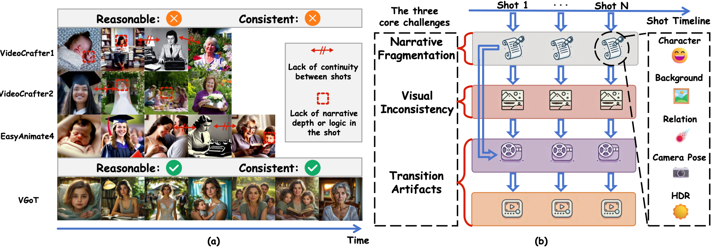
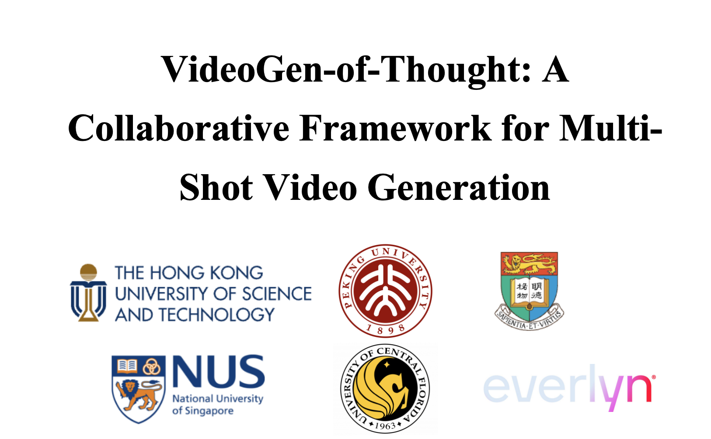
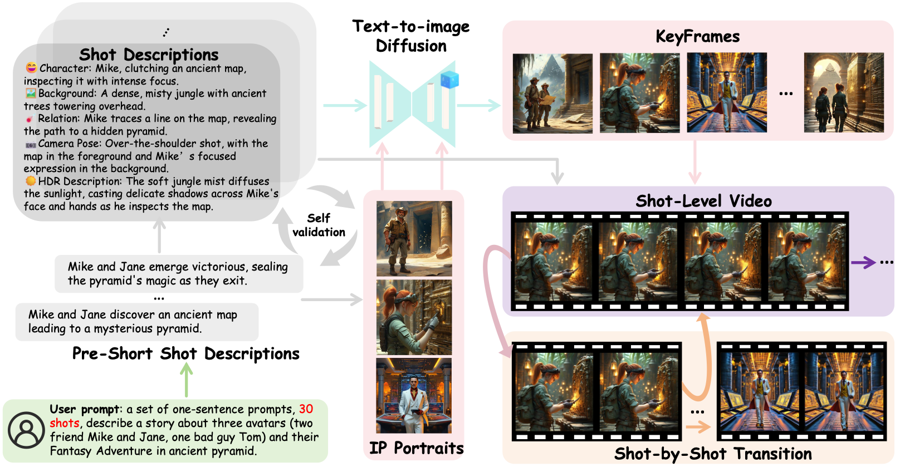

# VideoGen-of-Thought (VGoT)

Official implementation of *VideoGen-of-Thought: Step-by-step generating multi-shot video with minimal manual intervention*, old version titled: *VideoGen-of-Thought: A Collaborative Framework for Multi-Shot Video Generation*

<p align="center">

<br>
<b>Illustration of <i>VideoGen-of-Thought (VGoT)</i>.</b>
</p>


[](https://www.youtube.com/watch?v=O3UBlwqQKnw)<p align="center"><b>Demo Video of <i>VGoT</i> V1, V2 TBD.</b>
</p>

## 📣 News

* ⏳⏳⏳ Release the latest version of arxiv paper

* `[2025.03.19]`  We publish official code and detailed instruction & evaluation

* `[2024.12.03]`  🔥 We release the arXiv paper for VGoT, and you can click [here](https://arxiv.org/abs/2412.02259) to see more details.


## Abstract

Current video generation models excel at short clips but fail to produce cohesive multi-shot narratives due to disjointed visual dynamics and fractured storylines. 
Existing solutions either rely on extensive manual scripting/editing or prioritize single-shot fidelity over cross-scene continuity, limiting their practicality for movie-like content. 
We introduce VideoGen-of-Thought *(VGoT)*, a step-by-step framework that automates multi-shot video synthesis **from a single sentence** by systematically addressing three core challenges: 
**(1) Narrative Fragmentation**: Existing methods lack structured storytelling. We propose **dynamic storyline modeling**, which first converts the user prompt into concise shot descriptions, then elaborates them into detailed, cinematic specifications across five domains (character dynamics, background continuity, relationship evolution, camera movements, HDR lighting), ensuring logical narrative progression with self-validation.
**(2) Visual Inconsistency**: Existing approaches struggle with maintaining visual consistency across shots. Our **identity-aware cross-shot propagation** generates identity-preserving portrait (IPP) tokens that maintain character fidelity while allowing trait variations (expressions, aging) dictated by the storyline.
**(3) Transition Artifacts**: Abrupt shot changes disrupt immersion. Our **adjacent latent transition mechanisms** implement boundary-aware reset strategies that process adjacent shots' features at transition points, enabling seamless visual flow while preserving narrative continuity.
By integrating these innovations into a training-free pipeline, VGoT generates multi-shot videos that outperform state-of-the-art baselines by **20.4% in within-shot face consistency** and **17.4% in style consistency**, while achieving **over 100% better cross-shot consistency** and **10× fewer manual adjustments** than alternatives like MovieDreamer and DreamFactory. 
Our work redefines automated long-video generation, bridging the gap between raw visual synthesis and director-level storytelling.

## ⚙️ Preparations

We recommend the requirements as follows.

### Environment

```bash
# 0. Clone the repo
git clone --depth=1 https://github.com/DuNGEOnmassster/VideoGen-of-Thought.git
cd VideoGen-of-Thought

# 1. Create conda environment
conda create -n VideoGen-of-Thought python=3.10
conda activate VideoGen-of-Thought

# (Optional) Install PyTorch and other dependencies using conda, we test on cuda 11.8 and cuda 12.1
# CUDA 11.8
conda install pytorch==2.2.2 torchvision==0.17.2 torchaudio==2.2.2 pytorch-cuda=11.8 -c pytorch -c nvidia
# CUDA 12.1
conda install pytorch==2.2.2 torchvision==0.17.2 torchaudio==2.2.2 pytorch-cuda=12.1 -c pytorch -c nvidia

# 2. Install pip dependencies, we have already provided paired PyTorch and xformers in our requirements.
pip install -r requirements.txt
```

### Download Pretrained Weights

We appriciate the amazing open-source work by [Kolor](https://github.com/Kwai-Kolors/Kolors.git) and [DynamiCrafter](https://github.com/Doubiiu/DynamiCrafter.git), for the current version of *VGoT*, you can directly download the pretrained weights through:

```bash
sh download_weights.sh
```

Once ready, the weights will be organized in this format:

```
📦 weights/
├── 📂 DynamiCrafter/
├──── 📄 model.ckpt
├──── ...
├── 📂 Kolors/
├──── 📂 scheduler/
├──── 📂 text_encoder/
├──── 📂 tokenizer/
├──── 📂 unet/
├──── 📂 vae/
├──── 📄 model_index.json
├──── ...
├── 📂 Kolors-IP-Adapter-Plus/
├──── 📂 image_encoder/
├──── 📄 ip_adapter_plus_general.bin
├──── 📄 model_index.json
├──── 📄 config.json
├──── ...
├── 📂 ViCLIP-B-16-hf/
├──── ...
```

### Prepare GPT-4o token

Don't forget to create a file ``configs/config.txt`` to place your GPT-4o token, please refer to [this guide](https://github.com/DuNGEOnmassster/VideoGen-of-Thought/blob/main/configs/READMD.md)

## ✨ Inference

<p align="center">

<br>
<b>The FlowChart of <i>VideoGen-of-Thought (VGoT)</i>.</b>
</p>

### User Friendly Process

For the full *VGoT* generation, you can directly process:

You can directly process:

```bash
sh run_vgot.sh
```

you only need to provide  **one sentence input**, then *VGoT* will automatically generate the whole multi-shot video in a step-by-step manner, without manual intervention.

For a more clear overview of our proposed methods shown in the Flowchart, we provide step-by-step and user-friendly shell scripts to process.

### Test Dynamic Storyline

You can directly process:

```bash
sh test_dynamic_storyline.sh
```

where you will obtain the storylines from given **one sentence input**, which expected to contains ``short_shot_description.txt``, ``avatar_prompt.json``, and ``image_prompt_pairs.json`` under work dir.

### Test Cross Shot Propagation

You can directly process:

```bash
sh test_cross_shot_propagation.sh
```

where you will find we bring avatars to life from the storylines, and enable the identity-preserving portraits be maintained in the KeyFrames for each shots.


## Evaluation

We provide detailed multi-shot evaluation tools under ``evaluate/code/``, and the experimental results for comparison are provided under ``Experiment``

| Model               | CLIP ↑  | WS-FC ↑  | CS-FC ↑  | WS-SC ↑  | CS-SC ↑  |
|---------------------|---------|----------|----------|----------|----------|
| EasyAnimate         | 0.2402  | 0.4705   | 0.0268   | 0.7969   | 0.2037   |
| CogVideo            | 0.2477  | *0.6099* | 0.0222   | 0.7424   | *0.2069* |
| VideoCrafter1       | 0.2478  | 0.3706   | 0.0350   | 0.7623   | 0.1867   |
| VideoCrafter2       | *0.2529*| 0.5569   | *0.0686* | *0.7981* | 0.1798   |
| **VGoT**            | **0.2557**| **0.8138**| **0.2688**| **0.9717**| **0.4276**|

✨ Feel free to use our evaluation code and suggestions are always welcomed!

## 👍 Acknowledgement

This project wouldn't be possible without the following open-sourced repositories: [IP-Adapter](https://github.com/tencent-ailab/IP-Adapter), [Kolor](https://github.com/Kwai-Kolors/Kolors.git), [DynamiCrafter](https://github.com/Doubiiu/DynamiCrafter.git), [CogVideoX](https://github.com/THUDM/CogVideo), [EasyAnimate](https://github.com/aigc-apps/EasyAnimate), [VideoCrafterV1/V2](https://github.com/AILab-CVC/VideoCrafter.git), [FIFO-Diffusion](https://github.com/jjihwan/FIFO-Diffusion_public.git). Also appreciate for the development of LLMs, and thanks [@Shenghai](https://github.com/SHYuanBest), [@Xianfeng](https://github.com/XianfengWu01), and [@Horald](https://github.com/HaroldChen19) for their help.


## ✏️ Citation

If you find our paper and code useful in your research, please consider giving a star 🌟 and citation ✏️.

- [ ] Release V2 arxiv and update information here

```Bibtex
@article{zheng2024videogen,
  title={VideoGen-of-Thought: A Collaborative Framework for Multi-Shot Video Generation},
  author={Zheng, Mingzhe and Xu, Yongqi and Huang, Haojian and Ma, Xuran and Liu, Yexin and Shu, Wenjie and Pang, Yatian and Tang, Feilong and Chen, Qifeng and Yang, Harry and others},
  journal={arXiv preprint arXiv:2412.02259},
  year={2024}
}
```